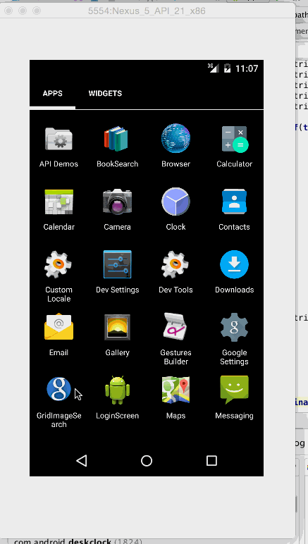

# Android CodePath Week2: Grid Image Search

Version 1.2

Overview: Build a Google Image Search app which allows a user to select search filters and paginate results infinitely.

Time spent: 8 hours spent in total

Quick manual notes of app usage:

1. User can enter a search query that will display a grid of image results from the Google Image API.

2. User can click on "settings" which allows selection of advanced search options to filter results

3. User can configure advanced search filters such as:
	- Size (small, medium, large, extra-large)
	- Color filter (black, blue, brown, gray, green, etc...)
	- Type (faces, photo, clip art, line art)
	- Site (espn.com)
4. Subsequent searches will have any filters applied to the search results

5. User can tap on any image in results to see the image full-screen

6. User can scroll down “infinitely” to continue loading more image results (up to 8 pages)

Animated gif walkthrough of this demo todo list app:

GIF created with [LiceCap](http://www.cockos.com/licecap/).
